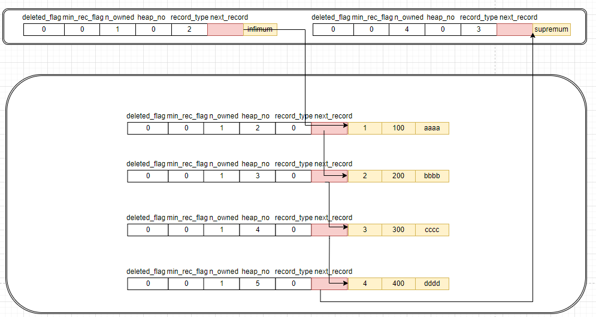
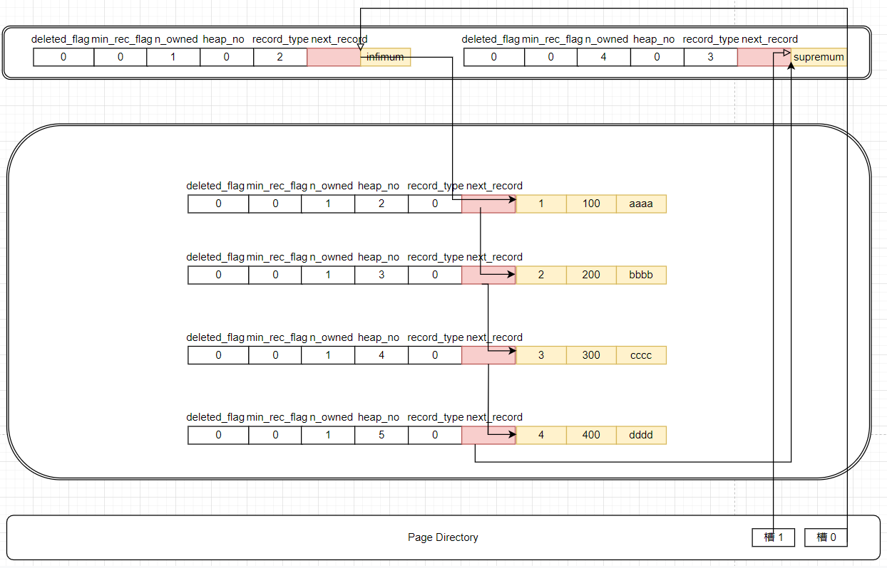

## 数据页结构

数据页可以分为以下几个部分


### 行记录头信息

以 compact 行格式为例，它的头信息共 5 字节，各字段含义如下：

| 名称         | 大小(bit) | 功能                                                         |
| ------------ | --------- | ------------------------------------------------------------ |
| 预留位1      | 1         | 未使用                                                       |
| 预留位2      | 1         | 未使用                                                       |
| deleted_flag | 1         | 记录是否被删除                                               |
| min_rec_flag | 1         | B+树每层非叶子节点中最小的目录项都会添加该标记               |
| n_owned      | 4         | 一个页面会被分组，组长会通过该值记录组员的数量，而组员该值均为0 |
| heap_no      | 13        | 当前记录在页面堆的相对位置                                   |
| record_type  | 3         | 记录类型，0 表普通，1 表示非叶子节点的目录项记录，2 表示最小值，3 表示最大值 |
| next_record  | 16        | 下一条记录的相对位置                                         |

上面提到的堆并不是页面，而是这些记录构成的结构；而 heap_no 这个字段并不是这些记录的偏移位置，而是从 2 开始的编号；每条记录都比前一条记录大 1；而 0 和 1 则分别是最小值和最大值的编号。这两条记录在每个页面中都有。

而上面提到的 next_record 字段，则表示按照下一条记录真实数据的起始位置相对当前记录真实数据起始位置的相对偏移，可正可负。

假设有如下表结构：

```sql
create table page_demo (
	c1 int,
    c2 int,
    c3 varchar(10000),
    PRIMARY KEY (c1)
) CHARSET=ascii ROW_FORMAT=COMPACT
```

如果向表中插入四条记录：

```sql
insert into page_demo values (1,100,'aaaa'),(2,200,'bbbb'),(3,300,'cccc'),(4,400,'dddd');
```


则在页面中结构如下：




### Page Directory

当在一个页中根据主键查询数据时，传统的方式是按序将整个链表遍历一遍；

innodb 中不同，它将数据分组了（被删除的记录不算，会加入到垃圾链表用来重用），每若干条记录会被分到一个组中；这些记录中老大的数据起始位置在页面的偏移地址会被单独提取出来，找个偏移量占用 2 个字节，按序存储到页面尾部。这些记录被称为槽，而众多槽就组成了 Page Directory，即页目录。如上面的页面记录，则是如下结构：



可以看到，越小的组长，其槽位越靠近页面尾部。

分组是有规定的，infi 成员数只能有 1 条，而 supre 成员数不能此超过过 8 条，中间那些组长成员的数量在 4 - 8 之间。

按照主键查记录时，先通过槽位定位到记录所在的分组；找到该分组后通过前后槽位可以确定该组最小元素的起始位置，然后顺着链表就可以找到记录或者判断其不存在。


### Page Header

这部分主要是为了快速得到数据页的状态信息，它占用固定的 56 字节：

| 状态名称          | 大小(字节) | 功能                                                         |
| ----------------- | ---------- | ------------------------------------------------------------ |
| PAGE_N_DIR_SLOTS  | 2          | 页中槽数量                                                   |
| PAGE_HEAP_TOP     | 2          | 未使用的空间最小地址，即 FREE SPACE 的起始位置               |
| PAGE_N_HEAP       | 2          | 第 1 位表示是否是紧凑型记录<font color=red>(???)</font>, 剩下 15 位表示堆中<font color=red>所有记录</font>的数量。 |
| PAGE_FREE         | 2          | 被删除节点组成的链表中，头结点数据在页面的偏移量             |
| PAGE_GARBAGE      | 2          | 已删除记录占用的字节数                                       |
| PAGE_LAST_INSERT  | 2          | 最后插入记录的位置                                           |
| PAGE_DIRECTION    | 2          | 记录插入方向                                                 |
| PAGE_N_DIRECTION  | 2          | 一个方向连续插入的记录数量                                   |
| PAGE_N_RECS       | 2          | 页面中有效记录的数量（不包含默认的两条记录和被删除记录）     |
| PAGE_MAX_TRX_ID   | 8          | 仅二级索引页面定义，记录修改当前页的最大事务 id              |
| PAGE_LEVEL        | 2          | 当前页在树中的层级                                           |
| PAGE_INDEX_ID     | 8          | 索引 ID， 表示当前页属于哪个索引                             |
| PAGE_BTR_SEG_LEAF | 10         | 仅根页面定义，叶子结点段头部信息                             |
| PAGE_BTR_SEG_TOP  | 10         | 仅根页面定义，非叶子节点段头部信息                           |


### File Header

这部分占用固定的 38 字节：

| 状态名称                         | 大小(字节) | 功能                                                    |
| -------------------------------- | ---------- | ------------------------------------------------------- |
| FIL_PAGE_SPACE_OR_CHKSUM         | 4          | 页面校验和                                              |
| FIL_PAGE_OFFSET                  | 4          | 页号                                                    |
| FIL_PAGE_PREV                    | 4          | 上一个页面页号                                          |
| FIL_PAGE_NEXT                    | 4          | 下一个页面页号                                          |
| FIL_PAGE_LSN                     | 8          | 页面最后被修改时的日志序列号                            |
| FIL_PAGE_TYPE                    | 2          | 页面类型                                                |
| FIL_PAGE_FILE_FLUSH_LSN          | 8          | 仅系统表空间第一个页定义，代表文件至少被刷新到了 LSN 值 |
| FIL_PAGE_ARCH_LOG_NO_OR_SPACE_ID | 4          | 页属于哪个表空间                                        |


### File Trailer

这部分一共 8 个字节。

- 前 4 个字节表示页的校验和，刷新页面时，页面的校验和会先算出来，然后实际刷新时先刷头部，再刷尾部，如果首位的校验和相同，则表示该页修改成功，否则失败；
- 后 4 字节表示最后被修改时的 LSN 的后 4 字节，正常情况下它与 FIL_PAGE_FILE_FLUSH_LSN 的后 4 字节相同。