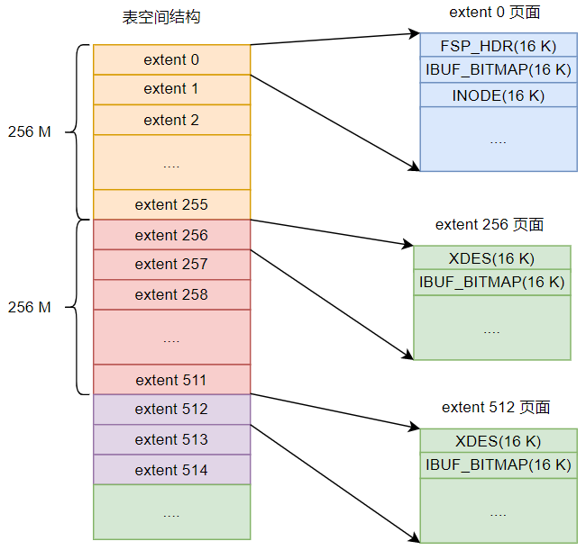
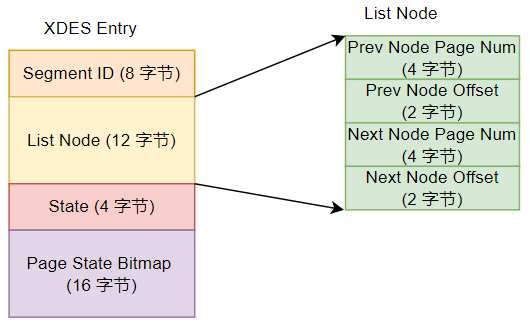
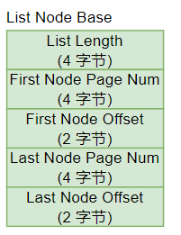
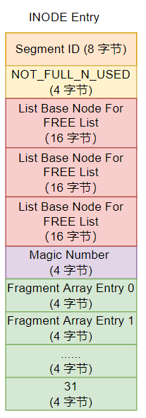
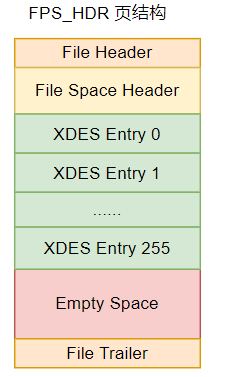
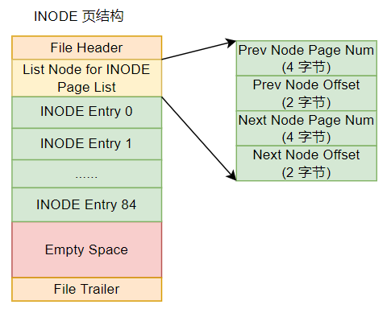
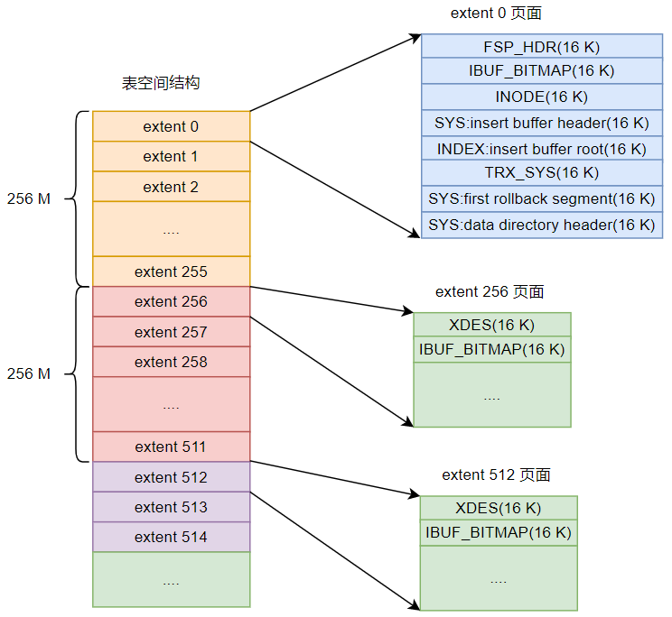

## 独立表空间

### 区(extent)

innodb 中，若干个连续的页组成一个区，如果页面是 16 k，则是连续的 64 个页面，区大小是 1M。 这里有个问题是，区的大小是不是固定为 1M， 还是 64 个连续页面是必须的？

而每 256 个区又被划分成一个组。

这些组几乎拥有完全一样的结构，但是第一个组是个例外。每个组最开始的两个页面类型固定，而第一个组（组 0）则是前三个页面固定。如下图：

可以看到对第一个组来说，前 3 个页面如下：

- FSP_HDR，标记整个表空间和本组所有区的属性，一个表空间只有这一个；
- IBUF_BITMAP，存储 change buffer；
- INODE，存储 INODE ENTRY；

对于其它组来说，前两个页面如下：

- XDES，extent descriptor，存储本组 256 个区的属性；
- IBUF_BITMAP，同上；

### 段

主要是解决随机 IO 的问题，因为一个索引中，叶子和非叶子节点都放在同一个大区的话，对查询还是会有影响；因此 innodb 中又引入段的概念，同一个索引中，叶子节点和非叶子节点都有自己的段，而每个段是一组区的集合。段以区为单位进行申请，但是一个区默认 1 M，如果表不大的话，容易浪费，因此 Innodb 中有一部分区为碎片区，碎片区中的页没有明确的段归属，直属于表空间；当一个段开始申请存储空间时，会先去碎片区中申请分配，一直到该段占用的碎片区页数达到 32 个，才会申请正式的区空间。

一个段=零散页面+完整的区空间。

注意，碎片区也是区的一种。

### 区分类

- 空闲区，区中任何页面都没有被分配，FREE；
- 有剩余页面的碎片区,FREE_FRAG；
- 没有剩余页面的碎片区,FULL_FRAG；
- 附属于指定段的区,FSEG；

### XDES Entry

一个 XDES Entry 占用 40 个字节：

- Segment ID，字如其意；
- List Node，将 XDES Entry 串联成一个双向链表；
- State，前面说的一个区的 4 种状态，不过 State 占用 4 个字节属实有点儿浪费了；
- Page State Bitmap，16 字节共 128 位，因为一个 XDES Entry 要记录一个组 64 个页面的信息，因此就是每个区占用 2 位，其中 1 位表示页是否空闲，另一位没用；

#### 碎片区空闲页的申请

当从碎片区申请空闲页时，先从 FREE_FRAG 类型的区中取一个空闲页给申请方使用；如果没有这样的区，就去 FREE 区中申请一个，放在 FREE_FRAG 中，然后取出一个页面给申请方使用；为了能快速定位到 FREE 和 FREE_FRAG 区，innodb 使用上面的 List Node 链表串联起相关信息：

- FREE 类型的区对应的 XDES Entry 串联成一个链表；
- FREE_FRAG 类型的区对应的 XDES Entry 串联成一个链表；
- FULL_FRAG 类型的区对应的 XDES Entry 串联成一个链表；

#### 区的 XDES Entry 链表

碎片区会有上面的 3 种类型链表，FSEG 也有自己的链表，但不是所有 FSEG 区都串联在同一个链表上，而是每个索引的每个段都有自己的三个链表：

- FREE 链表，一个段中所有页面都是空闲的区对应的 XDES Entry 都会加入该链表中；
- NOT_FULL 链表，仍有空闲页面的区对应的 XDES Entry 会加入该链表；
- FULL 链表，已经没有空闲页面的区对应的 XDES Entry 会加入该链表；

#### 链表基结点

上面链表都有自己的结构体保存头尾指针：

这个基结点信息保存在段的 INODE Entry 结构中。

### 段的 INODE Entry 结构

一个段的 INODE Entry 结构记录了该段的属性：

- Segment ID， INODE Entry 对应的段编号；
- NOT_FULL_N_USED, NOT_FULL 链表中已经用了多少页面，为什么要单独给整个链表设置一个这样的值呢？
- 3 个 List Base Node，一个段上那 3 个链表的信息；
- Magic Number，标记 INODE Entry 是否已经被初始化；有固定值；
- Fragment Array Entry，一个段中 32 个零散页面的信息；

### 不同类型的页面

#### FSP_HDR

FSP_HDR 页面是整个表空间的第一个页面，它存储表空间整体属性和第一个组内 256 个区的 XDES Entry 结构。

该类型页面结构如下：

| 名称              | 中文名       | 字节大小 | 描述           |
| ----------------- | ------------ | -------- | -------------- |
| File Header       | 文件头部     | 38       | 页面通用信息   |
| File Space Header | 表空间头部   | 112      | 表空间整体属性 |
| XDES Entry        | 区描述信息   | 10240    | 本组区信息     |
| Empty Space       | 尚未使用空间 | 5986     | 填充，无用     |
| File Trailer      | 文件尾部     | 8        | 校验页面完整性 |

##### File Space Header

| 名称                                    | 字节大小 | 描述                                                         |
| --------------------------------------- | -------- | ------------------------------------------------------------ |
| Space ID                                | 4        | 表空间 ID                                                    |
| Not Used                                | 4        |                                                              |
| Size                                    | 4        | 当前表空间拥有的页面数                                       |
| FREE Limit                              | 4        | 尚未被初始化的最小页号，不小于该页号的区对应的 XDES Entry 都没有加入到 FREE 链表 |
| Space Flags                             | 4        | 表空间中占用空间比较小的一些属性                             |
| FRAG_N_USED                             | 4        | FREE_FRAG 链表中已使用的页面数量                             |
| List Base Node for FREE List            | 16       | FREE 链表基结点                                              |
| List Base Node for FREE_FRAG List       | 16       | FREE_FRAG 链表基结点                                         |
| List Base Node for FULL_FRAG List       | 16       | FULL_FRAG 链表基结点                                         |
| Next Unused Segment ID                  | 8        | 当前表空间中下一个未使用的段 ID                              |
| List Base Node for SEG_INODES_FULL List | 16       | SEG_INODES_FULL 链表基结点                                   |
| List Base Node for SEG_INODES_FREE List | 16       | SEG_INODES_FREE 链表基结点                                   |

可以看到表空间的 3 个链表基结点就在 File Space Header 中；

最后两个，每个段的 INODE Entry 会集中存放到 INODE 页中，此时可能出现多个 INODE Entry 存放不到一个页中的情况，会存储在多个 INODE 页中，这些页会通过上面的两个链表串起来，没有空闲空间存放 INODE Entry 的放在 FULL 链表中，有的则放在 FREE 链表中。

##### XDES Entry 

这部分正是每个第一个组中每个区自己的  XDES Entry。

#### XDES 

这个类型的页面与 FSP_HDR 很像，只是它只记录它自己所在组的各区的信息，因此相比 FSP_HDR 类型，它只是没有 File Space Header 部分，其它与 FSP_HDR 严格相同，没有的这部分只是没有用，但空间还是占着。

#### IBUF_BITMAP

当插入记录时，先往聚簇索引页面插入，再往二级索引页面插入；由于二级索引的不连续，可能导致大量随机 IO。为了提高性能， Innodb 中引入 Change Buffer 结构，当修改非唯一二级索引页面时，如果该页面尚未加载，则修改会先暂存到 Change Buffer 上，等到有机会时，才会写入相关页面。由于这个功能曾经只针对 INSERT 操作，因此曾经称为 Insert Buffer，所谓的 IBUF 其实就是 Insert Buffer 的缩写。

#### INODE 

INODE 类型的页面记录了所有 INODE Entry 结构，它的页面结构如下：

| 名称                          | 中文名          | 字节大小 | 描述                          |
| ----------------------------- | --------------- | -------- | ----------------------------- |
| File Header                   | 文件头          | 38       | 页通用信息                    |
| List Node for INODE Page List | 通用链表节点    | 12       | 链表节点前后节点信息          |
| INODE Entry                   | 段的 inode 信息 | 16320    | 一共 85 个，每个占用 192 字节 |
| Empty Space                   | 未使用空间      | 6        |                               |
| File Trailer                  | 文件尾部        | 8        | 校验页是否完整                |

这里主要要注意的是 List Node for INODE Page List，正常每个段的信息会存储在区 0 的 INODE 页面中，但是这个页面最多只能存储 85 个段，如果段过多，就需要新的 INODE 页面来存储更多信息，Innodb 中使用了两个链表：

- SEG_INODES_FULL 链表，该链表中，INODE 类型的页面中没有空闲空间存储额外的 INODE Entry 结构；
- SEG_INODES_FREE 链表，该链表中，INODE 类型的页面还有空闲空间存储额外的 INODE Entry 结构；

而链表的头结点则存储在 FSP_HDR 页面的 File Space Header 中。

当创建一个新的段时，先去 SEG_INODES_FREE 链表中获取一个有空闲空间的 INODE 页面，将该段对应的 INODE Entry 信息存放在该页面中；如果没有这样的页面，则从表空间的 FREE_FRAG 链表上取一个这样的页面，修改类型为 INODE ，然后放到 SEG_INODES_FREE 链表上，并存储该段的 INODE Entry 信息；如果页面满了，就将该页面移动到 SEG_INODES_FULL 链表上。

##### Segment Header

问题在于一个段对应的 INODE Entry 是哪一个？每个索引都有一个叶子段和一个非叶子段，而且每个索引都是一颗 B+ 树，这棵树的根节点上有两个特殊的字段：

| 名称              | 占用字节数 | 描述                                            |
| ----------------- | ---------- | ----------------------------------------------- |
| PAGE_BTR_SEG_LEAF | 10         | B+ 树叶子节点段头部信息，仅在 B+ 树根页面定义   |
| PAGE_BTR_SEG_TOP  | 10         | B+ 树非叶子节点段头部信息，仅在 B+ 树根页面定义 |

这两个字段存储了每个索引两个段各自对应的 INODE Entry 信息，这样就不用遍历了。

## 系统表空间

非常类似于独立表空间，只是它要记录与整个系统有关的信息，整个 mysql 只有一个系统表空间，它的表空间 ID 是 0。

可以看到系统表空间中有几个特殊的页面：

| 页号 | 页面类型 | 英文                   | 描述                 |
| ---- | -------- | ---------------------- | -------------------- |
| 3    | SYS      | Insert Buffer Header   | Change Buffer 头信息 |
| 4    | INDEX    | Insert Buffer Root     | Change Buffer 根页面 |
| 5    | TRX_SYS  | Transction System      | 事务                 |
| 6    | SYS      | First Rollback Segment | 第一个回滚段         |
| 7    | SYS      | Data Dictionary Header | 数据字典头部信息     |

### Innodb 数据字典

#### SYS_TABLES 表

| 列名       | 描述      |
| ---------- | --------- |
| NAME       | 表名称    |
| ID         | 表 ID     |
| N_COLS     | 列个数    |
| TYPE       | 表类型    |
| MIX_ID     |           |
| MIX_LEN    |           |
| CLUSTER_ID |           |
| SPACE      | 表空间 ID |

这个表有两个索引：

- NAME，主键，聚簇索引，带了库名，不过查看表的创建语句，貌似没有明确说这个是主键；
- ID，二级索引；

#### SYS_COLUMNS 表

| 列名     | 描述                                               |
| -------- | -------------------------------------------------- |
| TABLE_ID | 列所属的表 ID                                      |
| POS      | 列在表中的列号                                     |
| NAME     | 列名称                                             |
| MTYPE    | 主数据类型                                         |
| PRTYPE   | 精确数据类型，如是否允许为 NULL,是否可以为负数等； |
| LEN      | 该列最多占用字节数                                 |
| PREC     | 0                                                  |

该表以(TABLE_ID,POS) 建立唯一聚簇索引。

#### SYS_INDEXS 表

| 列名            | 描述                                                     |
| --------------- | -------------------------------------------------------- |
| TABLE_ID        | 表 ID                                                    |
| ID              | 每个索引都有唯一 ID                                      |
| NAME            | 索引名称                                                 |
| N_FIELDS        | 索引包含的列个数                                         |
| TYPE            | 聚簇？唯一二级？...                                      |
| SPACE           | 索引根页面所在表空间 ID                                  |
| PAGE_NO         | 索引根页面页号                                           |
| MERGE_THRESHOLD | 页面中的记录被删除到某个比例，就尝试该页和相邻页面合并。 |

只有一个聚簇索引，(TABLE_ID,ID)。

#### SYS_FIELDS 表

| 列名     | 描述             |
| -------- | ---------------- |
| INDEX_ID | 列所属索引 ID    |
| POS      | 列在索引中的列号 |
| COL_NAME | 列名称           |

只有一个聚簇索引，(INDEX_ID,POS)

貌似列没有唯一编号，所以这里要存储列名称。

通过上面 4 个表，用户就可以获取其它系统表以及用户表的信息。而这 4 个表的元数据则硬编码到代码中，它们的索引信息则固定存储在 7 号页面中，就是 Data Dictionary Header